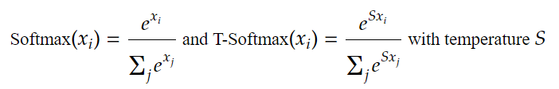
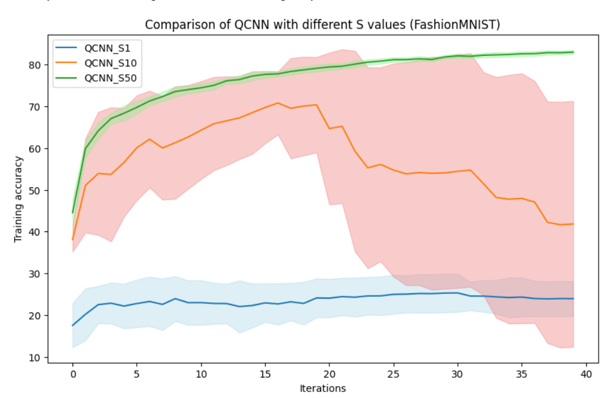

# Hamming-Weight preserving Quantum Convolutional Neural Network

 
 A simple QCNN structure 

This is a project that corresponds to the paper "Subspace Preserving  Quantum Convolutional Neural Network Architectures".

## Table of Contents
* [Hello world](#hello-world)
* [Tensor dataflow](#tensor-dataflow)
* [Dense circuit layouts](#dense-circuit-layouts)
* [Hyperparameters](#hyperparameters)
* [An interesting observation](#an-interesting-observation)

## Hello world
Let’s start with a simple QCNN network with exactly the same structure as above:
you can open and run "hello_work.ipynb". 

You may find that the result is bad, but it's a good way to understand this project step by step.
After understanding the meaning of these hyperparameters, 
you can design and test your own HW-QCNN structure with your PC or servers.
(e.g., add more RBS gates for dense layers and use larger I, J, etc.)

You can also execute HW2 (or HW3) QCNN as python file in the folder "Executable_files". 
Here the HW2 means the Hamming weight values is 2, i.e., the input tensor data is 2 dimensional (e.g. single channel images). Please read the paper for more details.

## Tensor dataflow

## Dense circuit layouts

<table>
  <tr>
    <td style="text-align:center">
       
      butterfly circuit
    </td>
    <td style="text-align:center">
       
      drip circuit
    </td>
    <td style="text-align:center">
       
      X circuit
    </td>
  </tr>
</table>
<table>
  <tr>
    <td style="text-align:center">
       
      full connection circuit
    </td>
    <td style="text-align:center">
       
      pyramid circuit
    </td>
  </tr>
  <tr>
    <td style="text-align:center">
       
      half connection circuit
    </td>
    <td style="text-align:center">
       
      slide circuit
    </td>
  </tr>
</table>

## Hyperparameters

This is the hyperparameter used for the training results in our paper:

I = 16,
J = 7,
k = 3,
K = 4,
stride = 2,
batch_size = 10,
kernel_layout = "all_connection",
training_dataset = 2000, 
testing_dataset = 1000,
is_shuffle = True,
learning_rate = 1e-2 * 0.66
gamma = 0.9
train_epochs = 30 (or 40),
test_interval = 10,
criterion = torch.nn.CrossEntropyLoss(),
softmax_temperature = 50

dense_full_gates = half_connection_circuit(O + J) + full_connection_circuit(O + J) + half_connection_circuit(
O + J) + full_connection_circuit(O + J) + slide_circuit(O + J - 1)
dense_reduce_gates = half_connection_circuit(reduced_qubit) + full_connection_circuit(
reduced_qubit) + half_connection_circuit(reduced_qubit) + slide_circuit(reduced_qubit)

## An interesting observation
Since we are using CrossEntropy as a Loss Function, it includes the softmax function.
Here, we use softmax with temperature instead of standard softmax.

Softmax temperature is popular in classical NLP, but interestingly, we found that it can significantly improve QCNN training results.
The following are definitions of the standard softmax and the softmax with temperature:

From this figure above (we calculate the variance and mean of the 10 training sessions), we observe that 
* when ***S=1*** (i.e. standard softmax), The network is not really be “optimized”.
* When ***S=10***, The network can be “optimized” but is very unstable.
* When ***S=50***, The network optimization is fast and stable.

The network can be greatly improved by tuning S (which is not achieved by tuning the learning rate), and perhaps can be further generalized to other types of quantum neural networks.