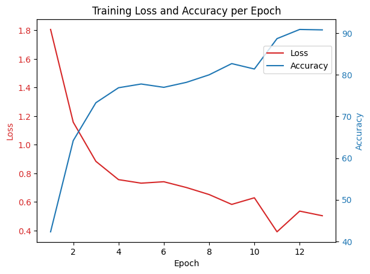

# Hamming-Weight preserving Quantum Convolutional Neural Network


## Table of Contents
* [Hello world](#hello-world)
* [Tensor dataflow](#tensor-dataflow)
* [Guide to test with LIP6 Cluster servers](#guide-to-test-with-LIP6-Cluster-servers)
* [Project directory structure](#project-directory-structure)
* [Dense circuit layouts](#dense-circuit-layouts)
* [Record](#record)

## Hello world
Let's start with a simple HW-QCNN network like the figure shown above: 
you can open and run "Playground/hello_work.ipynb".

It's ture that the result is bad, but it's a good way to understand this project step by step.
After understanding the meaning of these hyperparameters, 
you can design and test your own HW-QCNN structure with LIP6 cluster servers.
(e.g., add more RBS gates for dense layers and use larger I, J, etc.)

## Tensor dataflow


## Guide to test with LIP6 Cluster servers

The cluster server we use is called **Convergence**, you can check the website https://front.convergence.lip6.fr/convergence_en.html or my guide.

you can open a terminal and connect the server by:
```bash
(base) letao@ppqi29-wifi ~ % ssh letao@front.convergence.lip6.fr
Last login: Wed Apr 24 16:31:05 2024 from 132.227.92.49
(base) letao@front:~$
```
Here "letao" is my account name, you should replace it by yours.

After connected, please install the packages we need, at least pytorch, scipy, numpy, etc (e.g. you can use pip install) 
and clone this git, you only need to do this one time and the server will save all.

```bash
git clone git@github.com:ptitbroussou/HW_QCNN.git
```
Here you have two choices, interactive or non-interactive:
### Test in the LIP6 Cluster interactively
Alloc the server resource by:
```bash
(base) letao@front:~$ salloc --nodes=1 --gpus-per-node=a100_3g.40gb:1 --time=60
salloc: Granted job allocation 11162
salloc: Nodes node04 are ready for job
```
Here "time=60" means we use this computational node for 60 minutes, you can change it.

Now you can open a new terminal and execute:
```bash
(base) letao@ppqi29-wifi ~ % ssh -J letao@front.convergence.lip6.fr letao@node04.convergence.lip6.fr
Last login: Wed Apr 24 13:02:04 2024 from 2001:660:3302:28c7:6efe:54ff:fe4e:8a18
(base) letao@node04:~$
```

and execute the file you want 

```bash
(base) letao@node04~$ cd HW_QCNN/Cluster_files
(base) letao@node04:~/HW_QCNN/Cluster_files$ python QCNN_3D.py 
Epoch 0: Loss = 2.227023, accuracy = 10.0000 %
Epoch 1: Loss = 2.185051, accuracy = 10.0000 %
Epoch 2: Loss = 2.135189, accuracy = 30.0000 %
Epoch 3: Loss = 2.104200, accuracy = 30.0000 %
Epoch 4: Loss = 2.095546, accuracy = 30.0000 %
Epoch 5: Loss = 2.079498, accuracy = 30.0000 %
Epoch 6: Loss = 2.086181, accuracy = 30.0000 %
Epoch 7: Loss = 2.062258, accuracy = 30.0000 %
Epoch 8: Loss = 1.997192, accuracy = 30.0000 %
Epoch 9: Loss = 2.031348, accuracy = 30.0000 %
Evaluation on test set: Loss = 2.278623, accuracy = 14.0000 %
```

### Test in the LIP6 Cluster non-interactively
The advantage of this method over the last interactive one is that: 
you don't need to keep the SSH connection during training, it's more safe.

You can create a "batch.sh" file in the folder "Cluster_files" with content
```
#!/bin/bash

#SBATCH --job-name=run
#SBATCH --nodes=1
#SBATCH --constraint=amd
#SBATCH --cpus-per-gpu=16
#SBATCH --mem=80G
#SBATCH --gpus=a100_7g.80gb:1
#SBATCH --time=1500
#SBATCH --mail-type=ALL
#SBATCH --output=%x-%j.out
#SBATCH --error=%x-%j.err

python QCNN_3D.py
```
Here we can change:
* job-name=run: name shown in the squeue
* mem=80G: depends on GPU we use
* gpus=a100_7g.80gb:1: you can also use a100_3g.40gb, less waiting time
* time=1500: 1500min, means this program will stop in 25h

Then execute this file
```bash
(base) letao@front:~$ cd new/HW_QCNN/Cluster_files
(base) letao@front:~/new/HW_QCNN/Cluster_files$ sbatch batch.sh
Submitted batch job 13588
(base) letao@front:~/new/HW_QCNN/Cluster_files$ 
```
You can use the command "squeue" to check if your task is running (sometimes you need to wait). After the task finished (or time out), you can check a output file (or error file) in the current folder.
If you use "a100_7g.80gb", maybe it takes a lot of time to wait, you can change it to "a100_3g.40gb" or use the interactive way.

Little tips: you can use VS Code to ssh connect the server, it's a easy way to edit server files.

## Project directory structure
* Cluster_files: executable QCNN python files
* Playground: jupyter files to help you test and understand this project
* src: backend python methods for QCNN
* Verification_correction: files to verify the correctness of our methods

## Dense circuit layouts

<table>
  <tr>
    <td style="text-align:center">
      <br />
      <span>butterfly circuit</span>
    </td>
    <td style="text-align:center">
      <br />
      <span>drip circuit</span>
    </td>
    <td style="text-align:center">
      <br />
      <span>X circuit</span>
    </td>
  </tr>
</table>
<table>
  <tr>
    <td style="text-align:center">
      <br />
      <span>full connection circuit</span>
    </td>
    <td style="text-align:center">
      <br />
      <span>pyramid circuit</span>
    </td>
  </tr>
  <tr>
    <td style="text-align:center">
      <br />
      <span>full reverse connection circuit</span>
    </td>
    <td style="text-align:center">
      <br />
      <span>slide circuit</span>
    </td>
  </tr>
</table>

## Record
10 labels MNIST QCNN: final testing accuracy = 83.8% (1000 testing samples)

### Hyperparameters:
I = 16,
O = I//2 ,
J = 7,
k = 3,
K = 4,
stride = 2,
batch_size = 10,
training_dataset = 1000
testing_dataset = 1000,
is_shuffle = True,
learning_rate = (1e-2 for 0-9 epochs 1e-3 for 10 epochs, 1e-4 for 11-12 epochs),
train_epochs = 13,
test_interval = 10,
criterion = torch.nn.CrossEntropyLoss(),
output_scale = 20

dense_full_gates = ([(i,j) for i in range(O+J) for j in range(0, O+J) if i>j]+
[(i,j) for i in range(O+J) for j in range(0, O+J) if i!=j]+
[(i,j) for i in range(O+J) for j in range(0, O+J) if i>j]+
[(i,j) for i in range(O+J) for j in range(0, O+J) if i!=j]+
drip_circuit(O + J) + butterfly_circuit(O + J)+
[(i,(i+1)%(O+J)) for i in range(O+J-1)])

dense_reduce_gates = ([(i,j) for i in range(reduced_qubit) for j in range(reduced_qubit) if i>j]+
[(i,j) for i in range(reduced_qubit) for j in range(reduced_qubit) if i!=j]+
[(i,j) for i in range(reduced_qubit) for j in range(reduced_qubit) if i>j]+
[(i,(i+1)%(reduced_qubit)) for i in range(reduced_qubit)])