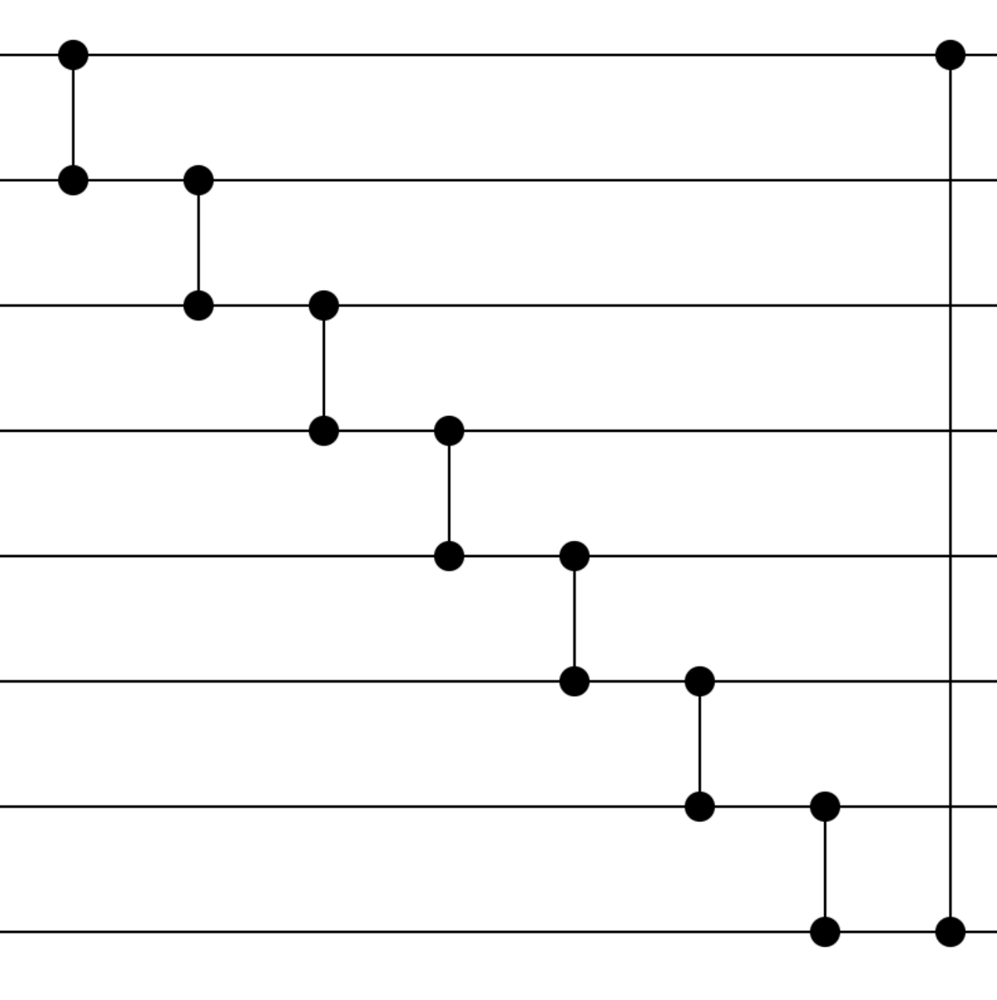

# Hamming-Weight preserving Quantum Convolutional Neural Network

---

 
 A simple QCNN structure 

## Table of Contents
* [Hello world](#hello-world)
* [Tensor dataflow](#tensor-dataflow)
* [Project directory structure](#project-directory-structure)
* [Dense circuit layouts](#dense-circuit-layouts)
* [Hyperparameters](#hyperparameters)

## Hello world
Let's start with a simple QCNN network like the figure shown above: 
you can open and run "Executable_files/hello_work.ipynb". 

You may find that the result is bad, but it's a good way to understand this project step by step.
After understanding the meaning of these hyperparameters, 
you can design and test your own HW-QCNN structure with your PC or servers.
(e.g., add more RBS gates for dense layers and use larger I, J, etc.)

This is a project that corresponds to the paper "Subspace Preserving  Quantum Convolutional Neural Network Architectures".
## Tensor dataflow

## Project directory structure
* Executable_files: QCNN python files
* IonQ_Simu: files about IonQ Simulation 
* Paper_data: The data we used in the paper
* src: backend python methods for QCNN
* Verification_correction: files to verify the correctness of our methods

## Dense circuit layouts

<table>
  <tr>
    <td style="text-align:center">
       
      butterfly circuit
    </td>
    <td style="text-align:center">
       
      drip circuit
    </td>
    <td style="text-align:center">
       
      X circuit
    </td>
  </tr>
</table>
<table>
  <tr>
    <td style="text-align:center">
       
      full connection circuit
    </td>
    <td style="text-align:center">
       
      pyramid circuit
    </td>
  </tr>
  <tr>
    <td style="text-align:center">
       
      half connection circuit
    </td>
    <td style="text-align:center">
       
      slide circuit
    </td>
  </tr>
</table>

## Hyperparameters
I = 16,
J = 7,
k = 3,
K = 4,
stride = 2,
batch_size = 10,
kernel_layout = "all_connection",
training_dataset = 2000, 
testing_dataset = 1000,
is_shuffle = True,
learning_rate = 1e-2 * 0.66
gamma = 0.9
train_epochs = 30 (or 40),
test_interval = 10,
criterion = torch.nn.CrossEntropyLoss(),
output_scale = 50

dense_full_gates = half_connection_circuit(O + J) + full_connection_circuit(O + J) + half_connection_circuit(
O + J) + full_connection_circuit(O + J) + slide_circuit(O + J - 1)
dense_reduce_gates = half_connection_circuit(reduced_qubit) + full_connection_circuit(
reduced_qubit) + half_connection_circuit(reduced_qubit) + slide_circuit(reduced_qubit)
